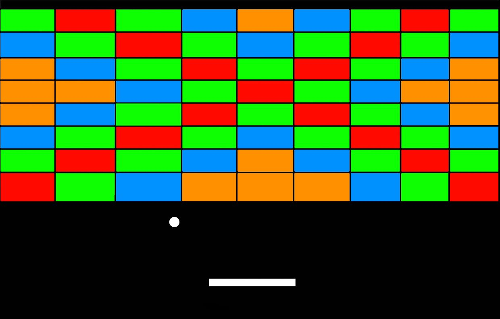
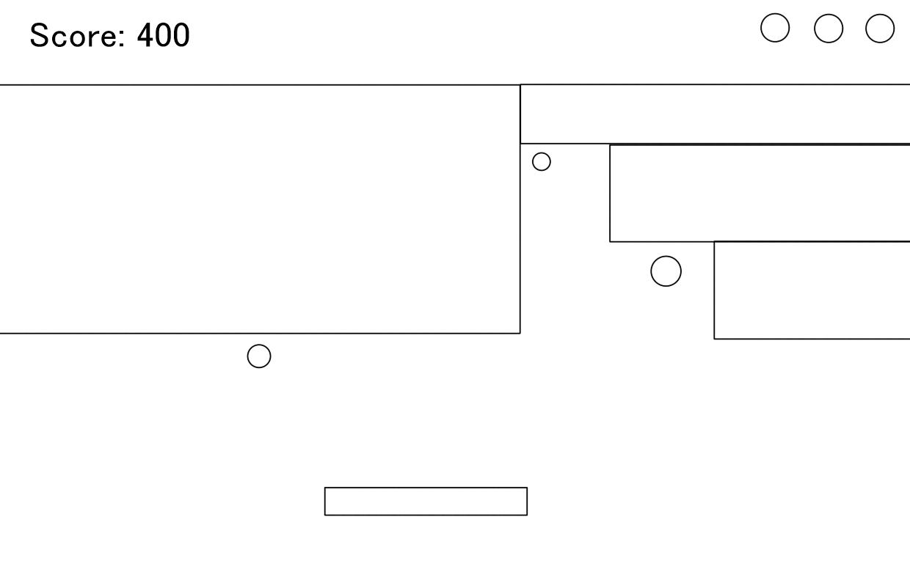

# Game Concept
This game is a small app for PIXI JS in the browser. It will be a recreation of breakout with slight tweaks.

## Genre
This will fall under the brick breaker genre.

## Platform
This will be made for desktop browsers.

## Story
No story, just pure arcade fun.

## Aesthetics
Blocky art, simple colors and shapes. The music and sound effects will be 8-bit/chiptune.

## Gameplay
The player controls the platform and has to continue bouncing balls against bricks of varying colors in order to break all of the bricks.
Once all of the bricks are broken the game is won, however if all of the balls are dropped then the game is lost. The game can be
controlled using WASD.

## Screenshots

## About the Author
My name is Sean Foley and I am a second year Game Design and Development student. I like to program, and create art and music.
I am proficient in C#, Java, HTML, CSS, Unity, Maya, Photoshop, Bosca Ceoil (8 bit music program) and various other music programs.
I like to draw, play piano and trombone, and I recently found an interest in ballroom dance.
